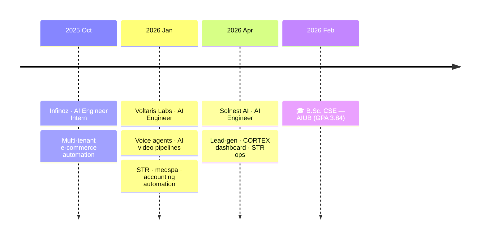

<div align="center">


[](https://git.io/typing-svg)

<br/>

<a href="mailto:nafiurrahman52@gmail.com"></a>
<a href="https://linkedin.com/in/nafiur-rahman-niloy"></a>
<a href="https://twitter.com/rahmanniloy10"></a>
<a href="https://instagram.com/rahman__niloy"></a>

<br/><br/>


&nbsp;

&nbsp;


</div>

---

## 🛰️ Currently

```yaml
🏢 role:        AI Automation Engineer & Web Developer @ Solnest AI
🎯 building:    Lead-gen automations · CORTEX dashboard · STR operations platform
🧪 exploring:   Agentic systems with LangGraph · Claude Code skills · 3D web with Three.js
🎓 finishing:   B.Sc. CSE — American International University-Bangladesh (Feb 2026)
📍 based in:    Dhaka, Bangladesh — open to remote
💬 ask me about: voice agents, n8n workflows, RAG pipelines, multi-tenant SaaS
```

---

## 📊 Impact Shipped

<div align="center">

<table>
<tr>
<td align="center" width="25%">
<h2>200+</h2>
<sub>customer conversations<br/>handled monthly</sub>
</td>
<td align="center" width="25%">
<h2>95%</h2>
<sub>chatbot response<br/>accuracy</sub>
</td>
<td align="center" width="25%">
<h2>60%</h2>
<sub>recruiter review<br/>time reduced</sub>
</td>
<td align="center" width="25%">
<h2>100+</h2>
<sub>applications<br/>auto-screened</sub>
</td>
</tr>
</table>

</div>

---

## 🧠 What I Build

<table width="100%">
<tr>
<td width="33%" valign="top">

### 🤖 Agentic AI
LangGraph & LangChain agents that plan, reason, and execute. Multi-step tool use with persistent memory.

</td>
<td width="33%" valign="top">

### 🎙️ Voice Agents
Production STT → LLM → TTS pipelines. Sub-second latency, real-time function calling, voicemail.

</td>
<td width="33%" valign="top">

### 🌐 Multi-Tenant SaaS
Next.js + Supabase + PostgreSQL. Schema-isolated tenants, role-based dashboards, billing.

</td>
</tr>
<tr>
<td width="33%" valign="top">

### ⚡ n8n Automation
Complex workflows orchestrating LLMs, vector DBs, CRMs, and APIs into zero-touch operations.

</td>
<td width="33%" valign="top">

### 🔍 RAG & Vector Search
Pinecone, PGVector, HuggingFace embeddings. Multilingual retrieval with semantic memory.

</td>
<td width="33%" valign="top">

### 📱 Mobile & Web
React Native (Expo), Next.js, GSAP. Cinematic landings, dashboards, and mobile apps.

</td>
</tr>
</table>

---

## 🗺️ Experience Timeline



---

## 🛠️ Tech Arsenal

<div align="center">

**🤖 Agentic & AI**


**🎙️ Voice AI**


**🌐 Frontend & Mobile**


**⚙️ Backend & Data**


**🧠 ML & Data Science**


</div>

---

## 🚀 Featured Builds

<div align="center">

<table>
<tr>
<td align="center" width="50%" valign="top">

### 🏢 [Solnest AI](https://github.com/nafiurrahmanniloy/solnest-ai)
**STR Operations Platform** — CORTEX dashboard + backend + guest agent + n8n automation. Production multi-tenant system for short-term rental operators.

`Next.js` `n8n` `LangChain` `PostgreSQL` `TypeScript`

</td>
<td align="center" width="50%" valign="top">

### 🎨 [Figma Skill](https://github.com/nafiurrahmanniloy/figma-skill) ⭐
**Universal Figma → Code** for Claude Code. Browse files, extract design tokens, generate code for 7 frameworks.

`Python` `Claude Code` `Figma API` `MCP`

</td>
</tr>
<tr>
<td align="center" width="50%" valign="top">

### 🚗 [GariBazar BD](https://github.com/nafiurrahmanniloy/garibazar-bd) ⭐
**Cinematic used-car marketplace** for Bangladesh. Dark, smooth-scroll landing built with GSAP + Lenis.

`HTML` `CSS` `GSAP` `Lenis` `TypeScript`

</td>
<td align="center" width="50%" valign="top">

### 🍔 [CraveMode Mobile](https://github.com/nafiurrahmanniloy/cravemode-mobile-app)
**React Native** app for AI-powered restaurant food photo & video enhancement. Built with Expo.

`React Native` `Expo` `TypeScript` `AI`

</td>
</tr>
<tr>
<td align="center" width="50%" valign="top">

### 🤖 [Infinoz AI Chatbot](https://github.com/nafiurrahmanniloy/infinoz-ai-chatbot)
**Live in production** at infinoz.com. Handles 200+ conversations/month at 95%+ accuracy with RAG and persistent memory.

`LangChain` `OpenAI` `n8n` `Messenger API`

</td>
<td align="center" width="50%" valign="top">

### 🌍 [Multilingual RAG](https://github.com/nafiurrahmanniloy/multilingual-rag-system) ⭐
**Cross-language RAG** with Pinecone vector search, HuggingFace embeddings, and Gemini orchestration.

`LangChain` `Pinecone` `HuggingFace` `Gemini`

</td>
</tr>
</table>

</div>

---

## 📈 GitHub Stats

<div align="center">


<br/><br/>


<br/><br/>


<br/>


</div>

---

<div align="center">

### 🐍 Contribution Graph


</div>

---

<div align="center">


### *Building systems that think, speak, and ship — so humans don't have to.*

<sub>⚡ Always shipping · 📬 [Email me](mailto:nafiurrahman52@gmail.com) · 💼 [LinkedIn](https://linkedin.com/in/nafiur-rahman-niloy)</sub>

</div>
